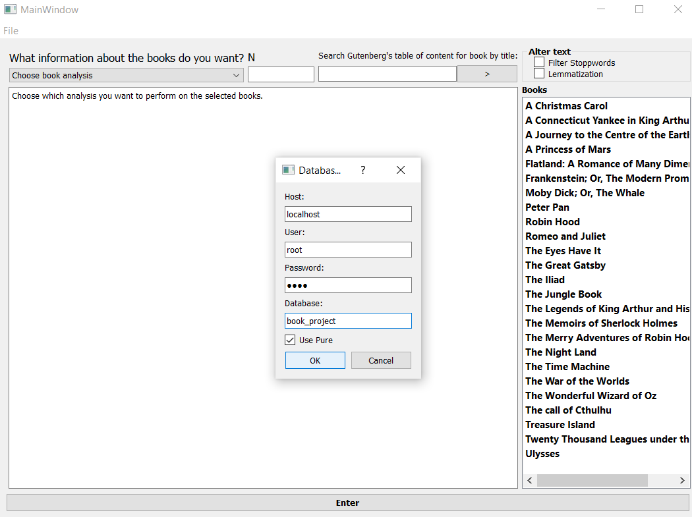
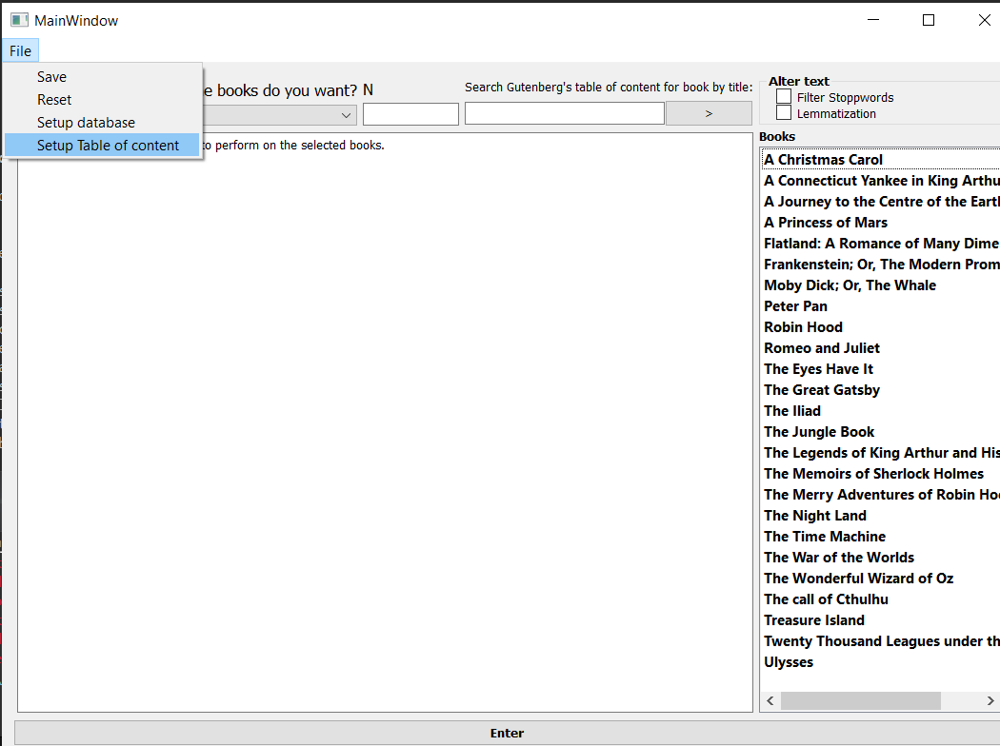
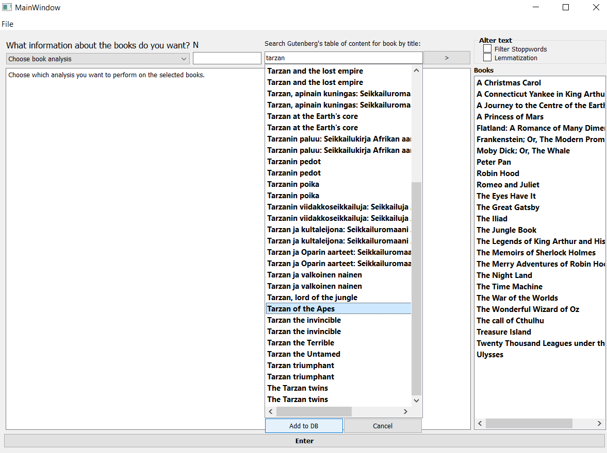
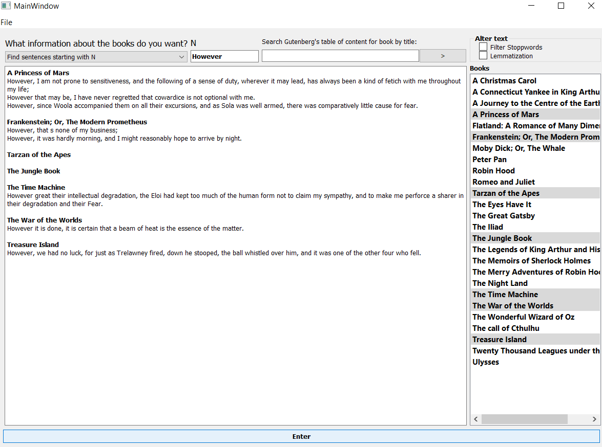
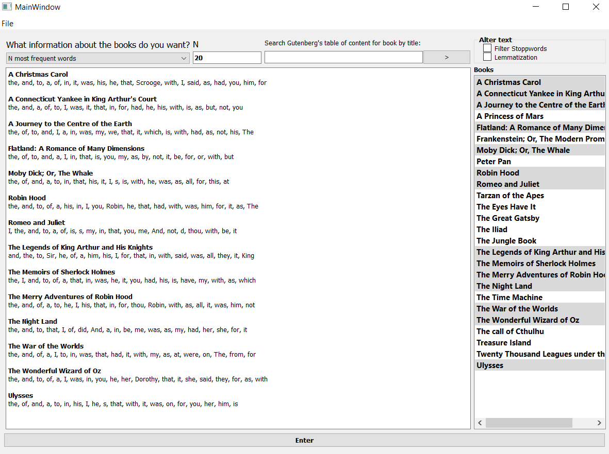
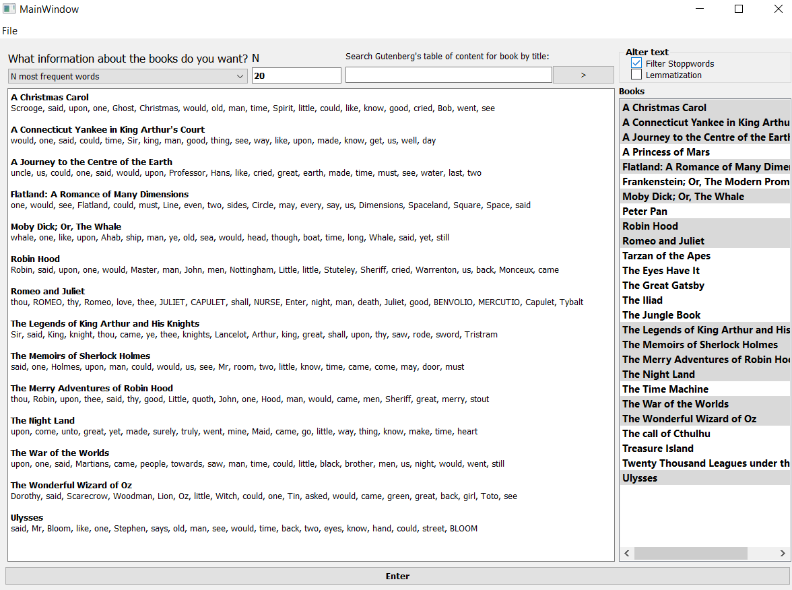
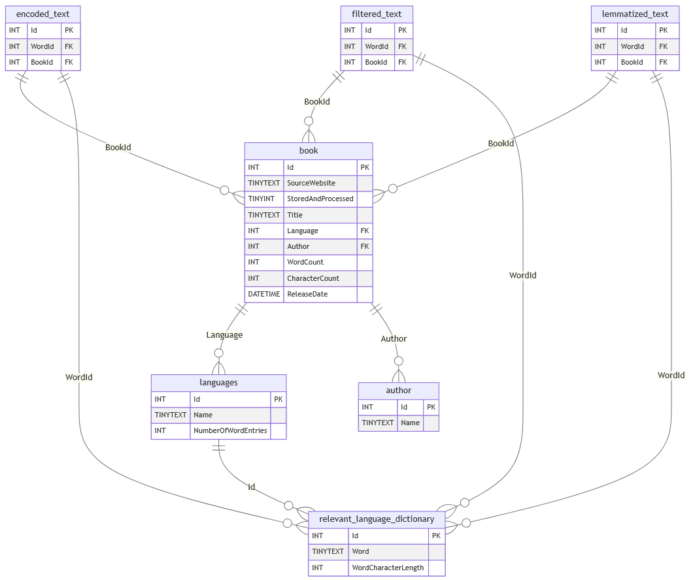

# Gutenberg Book Analyzer

This PyQt5-based GUI application provides tools for analyzing books from Project Gutenberg. It allows users to search for books, add them to a database, and perform various text analysis tasks. The application is structured in such a way that it should be able to run an analysis on an arbitrarily large number of books without being too hampered by an increased runtime. 

## Table of Contents

- [Introduction](#introduction)
- [Features](#features)
- [Installation](#installation)
- [Usage](#usage)
- [Code Structure](#code-structure)
- [License](#license) 


## Introduction

This project aims to allow the user to run word analysis on Project Gutenberg texts in a simple and expedient way.  It automates the scraping of basic book information and adds it to a table of content, showing the user all books available on Project Gutenberg. These books can then be scraped in full and will be encoded in a lexical cipher that is stored in a database. The applicationd provides basic analytical tools that can be applied to the books stored in the database. The GUI makes it easy to interact with the system and allows the user to perform the above mentioned tasks with minimal input.


## Features
**Table of Contents Setup:** 

Facilitates setting up the table of contents by scraping Project Gutenberg's website for all available books (using the Web Archive to minimize load on Gutenberg).

**Book Search**	

Search the established table of contents for books by title.

**Database Integration:** 

Add and encode selected books to a MySQL database for analysis.

**Text Analysis:** 

Perform various examples of text analysis on selected books, including:

* Finding the most frequent words.
* Finding the N most frequent words.
* Identifying words used only once.
* Generating word clouds.
* Finding the longest/shortest sentences.
* Calculating average sentence length.
* Finding sentences starting with a specific word.
* Identifying the longest words.
* Finding words with identical indices across books.
* Identifying the book with the most distinct word usage.

**Text Preprocessing:** 

Options for filtering stop words and lemmatization.

**User-Friendly Interface:** 

Intuitive PyQt5 interface with clear labels and controls.

**Database Configuration:** 

Allows users to set up a database with input connection details (host, user, password, database name). If it does not exist already, but the host, username and password is valid, the database and relevant tables will be created automatically.

 
## Installation

**1. Repository:**

git clone [https://github.com/helland/Webscraper-and-book-analysis/tree/main/webscraper_gutenberg](https://github.com/helland/Webscraper-and-book-analysis/tree/main/webscraper_gutenberg)
 

**2. Create a virtual environment (recommended):**
 
```bash

python3 -m venv .venv
source .venv/bin/activate  # On Windows: .venv\Scripts\activate
```
**3. Install the required packages:**

```bash

pip install    

PyQt5
mysql-connector-python
numpy
functools 
collections
wordcloud
collections  
concurrent.futures
re
fake_useragent
random
nltk
datetime
requests
bs4

```
**4. Optional: Use pyinstaller to create an exe file**

```bash
pip install    

pyinstaller 
```
Go to gui_main.py directory in command line and type:

```bash
pyinstaller --onefile -w exe_filname_of_your_choice.py
```
The exe file will be placed in the "dist" folder.

## Usage
If you created an exe file, simply double click it. Otherwise, run the main script:

```Bash
python gui_main.py
```
   
##### Database and Table of contents Setup: 

Go to File -> Setup database to configure your MySQL database connection. You'll need to provide the host, user, password, and database name.  The GUI will create the database and tables if they don't already exist. 



##### Table of Contents Setup: 

Go to File -> Setup Table of content to populate the database with information on all books available as well as the basic information about them (author, language etc.) from Gutenberg. Most importantly, it will add the links needed to download the full books. This may take some time, but once the information is stored in the database, you won't need to use it again unless you want to reupload it all with more up to date information from Gutenberg.


##### Book Search: 

Use the search bar to find books by title.  Select books from the search results and click "Add to DB" to add them to your database. The book will be encoded thrice. First, as the normal text of the book, second, the normal text with stopwords filtered out, and third, with the text lemmatized. How long it takes to encode and upload each book to the database, depends on the length of the book. The lengthier books can take several minutes if your hardware is somewhat dated.



##### Book Selection: 

Select books from the "Books" list widget to perform analysis on them. 



##### Analysis Selection:

Choose the desired analysis type from the dropdown menu.



Click the "Enter" button to run the selected analysis. The results will be displayed in the main text area. If the user wants to filter out stop words or lemmatize the text, they can use the check boxes in the upper right corner.



It is this word analysis the code has been optimized to run fast and in bulk. While encoding and uploading the books to a database slows down the process of analyzing the text, it allows the analysis itself to run much faster. The idea is that once your analysis functions become sufficiently complex and the amount of books you want to analyze becomes large enough, this roundabout method of storing and encoding the book texts will become increasingly worth it in terms of runtime. After all, the amount of time spent on storing and encoding books increases linearly with the number of books you want to handle, but the analyses can potentially have a runtime that increases exponentially (or at the very least, geometrically / nlogn, depending on what kind of analysis you wish to perform).

## Code Structure
frontend/: The main script can be found here along with modules for text formatting and other frontend utilities.
	
	frontend/gui_main.py: The main script that initializes and runs the PyQt5 GUI.
	frontend/mField_text_formatting.py: Functions that determine the appearance of text in the main field of the GUI.

webscraper/: Contains modules for web scraping, database interaction, book object definitions, and analysis functions.
	
	webscraper/__init__.py: A script for using the command-line to test the various functions of the backend.
	webscraper/init_database.py: Contains functions for database initialization (creating the database and its tables).
	webscraper/setup_scraper.py: Contains functions for scraping the table of contents (all available books on gutenberg) and populating the database.
	webscraper/scraper.py: Contains functions for scraping book data from Project Gutenberg and storing it in the database encoded.
	webscraper/utility_functions.py: Contains utility functions for database interaction, string manipulation, etc.
	webscraper/book.py: Defines a Book class to hold and sort the book data from the database while analyses are performed.
	webscraper/analysis_functions.py: Contains functions for text analysis (word frequency, sentence length, etc.).

misc/: nothing of note, except perhaps some diagrams and generated files (like wordclouds).
	
	misc/database_table_diagram: Mermaid code to show the database table structure.



## Improvements

##### Miscellaneous features that should be added:

Add a third scraper that goes through Project Gutenberg's categories and compares the book links found to those already in the database. If it finds a familiar link (meaning, a book that has already been saved in the database), it should then update a new table called "categories" with this book's id as well as another int value representing the category the scraper found the book saved under. As Gutenberg has a set amount of categories, these int values can either be hard coded, or added to a separate table where the category id corresponds to a category name (so, two new tables; "categories" with columns "Id" and "Name", as well as "books_in_category" with columns "BookId" and "CategoryId"). I would set the tables up in this way because each book can belong to multiple categories. A less efficient, but simpler way of doing it would be to simply have one table "categories" with column "BookId" (int) and "Category" (tinystring), but you would end up with a large number of identical string values.

Allow the user to print out the actual full text of a book in the application. As this application was meant for text analysis and not reading, this function was not prioritized (should the user desire to do so, they can always go to Gutenberg to read). Alternatively, print out basic information on selected books, including a link to where it can be found on Gutenberg.


##### Analysis function improvements and additions:

Integrate a connection to DictionaryAPI.com to find synonyms etc. for potential new analysis functions.

Integrate tools like "Vader" or "TextBlob" to make analysis functions that can describe tone, attitude or emotion in the text. 

Add analysis functions for determining sentence complexity.

Add analysis function for determining the text's readability index (using Flesch-Kincaid readability score).

Enable the user to get the results of their word analysis in the form of a graph instead of text in the main text field (so long as the analysis lends itself to visual output).

Immplement functions for handling the book's release date and make it possible for the user to perform analysis on the books based on this attribute.


##### Database improvements:

Use NLP tools to determine what type of word you're dealing with. This would preferably also be integrated into the database's dictionary tables, where an int value connected to each word indicated what the word is (verb, noun etc.)

Instead of storing words in lowercase, uppercase or partial upper/lower as separate words, each word should have gotten an int value in the dictionary table indicating its configuration. This way you can more easily treat upper and lowercase words as the same while still give out the corrent configuration in the end should there be a need to determine the word's exact configuration.


##### GUI function improvements:

Allow the user to choose how many search results show up (currently only 50 will appear along with a message of how many result were found in total).

Implement a browsing function, where the user can look through all available books instead of using a search term to filter out a subset.

Allow multiple words into the N field.

implement the save function, allowing the user to save the result to a text file.

implement the reset function, a simple way of removing selected books and filled out fields.

##### Performance improvements:

Either (or both) make it possible to populate the book objects holding all the information taken from the database on startup or create a button that will populate them at a time of the user's choosing. Right now the script will connect to the database and fill out the book object only when they are first used for an analysis, significantly slowing down the first analysis said book is used for (after which, due to lazy caching and how the book object is stored, any future analysis will no longer suffer this extra startup runtime). It also requires the code to connect multiple times to the database. If there was a button to "populate all now" (or do everything on startup), getting this information from the database could be sped up by doing it all in one connection.

Set user_pure=False. When use_pure is set to True, the database connection uses pure python code, which is slower than the alternative, which would use a C Extension that uses the MySQL C client library. This was set to True due to a non-functional C extension, but with the extension installed properly, it would make the database connections faster and improve the application's performance whenever it connects to the database.


## License
	public domain	
